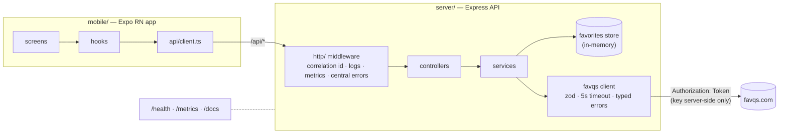

# Favorites Quotes

Fullstack assessment: an Express REST API that wraps the [FavQs API](https://favqs.com/api) and manages liked quotes, plus a small Expo React Native client. Single user, no auth, per the brief.

## Architecture



The app never talks to FavQs. The API key never leaves the server.

## Layout

- `server/` — Express + TypeScript API
- `mobile/` — Expo React Native app (React Navigation, React Native Paper)
- `docs/` — [SPEC](docs/SPEC.md), [DECISIONS](docs/DECISIONS.md), [SECRETS](docs/SECRETS.md)
- `tickets/` — the plan I worked from, one commit per ticket ([BACKLOG](tickets/BACKLOG.md))

## Run the API

Needs Node ≥ 20. Docker optional.

1. Sign up at [favqs.com](https://favqs.com), Settings → API Key.
2. `cd server && cp .env.example .env`, set `FAVQS_API_KEY`. The key lives in that file and nowhere else: not in the app, not in logs, not in the Docker image.

```bash
cd server && npm install && npm run dev     # standalone, port 4000
```

```bash
make docker-build && make docker-run        # container (make docker-stop)
```

```bash
make run                                    # API + Expo app together
```

`make help` lists the rest. Swagger UI: [localhost:4000/docs](http://localhost:4000/docs). Health: `/health`. Metrics: `/metrics`.

## Run the app

```bash
cd mobile && npm install && npx expo start  # press i for the iOS simulator
```

iOS simulator uses `http://localhost:4000` by default. Android emulator: copy `mobile/.env.example` to `.env` and set `EXPO_PUBLIC_API_URL=http://10.0.2.2:4000`. Physical device: your machine's IP.

## API

| Method & path | Success | Errors |
|---|---|---|
| `GET /api/quote` | 200 `{quote}` | 502 upstream failed, 504 upstream timeout |
| `GET /api/quotes/search?q=` | 200 `{quotes:[…]}` | 400 bad `q`, 502, 504 |
| `POST /api/favorites` | 201 created, 200 already saved (idempotent) | 400 invalid body |
| `GET /api/favorites` | 200 `{favorites:[…]}` newest first | — |
| `DELETE /api/favorites/:id` | 204 | 400 bad id, 404 unknown id |

Errors are always `{error: {code, message, correlationId}}`. Send `x-request-id` and it comes back as the correlation id, in the response and in the server logs.

## Tests

```bash
cd server && npm test               # unit + integration (vitest + supertest, 51 tests)
cd server && npm run test:coverage  # coverage gate: 90% lines, 85% branches
cd server && npm run test:e2e       # Playwright API tests, boots its own server
cd mobile && npm test               # screen + hook tests (jest-expo + RNTL, 16 tests)
make e2e-app                        # Maestro flow in the iOS simulator
```

CI runs lint, build, coverage-gated tests, the Playwright suite, mobile tests, and a Docker build on every push and PR.

## Assessment questions

**What did I implement?**
Everything in the required and optional scope: quote of the day, save/list/delete favorites, search, all three screens with loading/error/empty states, dark mode, tests on both sides. Plus what I'd want in any service I run: central error handling, JSON logs with correlation IDs, `/metrics`, OpenAPI docs, Docker, CI, graceful shutdown.

**Why did I implement or skip certain things?**
The backend is what's being evaluated, so the depth went there. I skipped a database (allowed by the brief, reasoning below), auth (out of scope), FavQs caching and retries (assessment traffic never hits their rate limits), and app-side state management (nothing to cache in an app this small).

**What trade-offs did I make?**
- In-memory storage: favorites die on restart. The `FavoritesStore` interface makes a Postgres/SQLite swap a one-file change.
- Express over NestJS: the brief asks for Express, and 6 endpoints don't justify Nest. The layout maps 1:1 to Nest anyway: controllers, services as providers, the error middleware as an exception filter.
- Services are thin passthroughs today. They're the seam where business logic lands when it exists.
- The OpenAPI spec is hand-written and can drift. Generating it from the zod schemas is the fix.

**What would I improve with more time?**
SQLite behind the existing store interface, a shared types package (the mobile client duplicates the DTOs), OpenAPI generated from zod, qotd caching plus retry with jitter on reads, rate limiting, OpenTelemetry tracing on top of the existing correlation IDs, E2E in CI against a mocked FavQs.

## Out of scope, on purpose

- **Auth**: single implicit user per the brief. If needed: OIDC, JWT checked in middleware before the routes, favorites keyed per user.
- **Database**: skipped for time and simplicity. Favorites sit in a `Map` behind the `FavoritesStore` interface, so a real store is a drop-in replacement in `index.ts`. First thing I'd add for production.
- **100% coverage**: the gate is 90/85 (actuals ~100/95). `index.ts` bootstrap and test helpers are excluded; a few defensive branches aren't worth synthetic tests. No snapshot tests (they assert markup, not behavior) and no Detox/Maestro in CI (too heavy for this scope).
- **FavQs resilience extras**: no caching, retries, or circuit breaker. Timeouts and typed upstream errors are in.
- **Deployment**: nothing is implemented because the reviewer can't run it. The sketch below is the plan, so the thinking is on record.

## Deployment sketch

The image is already the right shape: multi-stage, non-root, healthcheck, SIGTERM drain, env-only config, `/health` and `/metrics`. To ship it:

1. CI pushes the image (tagged by commit SHA) to a registry.
2. Kubernetes: Deployment with 2+ replicas, resource requests/limits, Service + Ingress, config from a ConfigMap, `FAVQS_API_KEY` from a secret manager ([docs/SECRETS.md](docs/SECRETS.md)). `/health` never calls FavQs, so it's safe for both liveness and readiness; a FavQs outage should surface as 502s, not pods dropping off the load balancer.
3. Swap the in-memory store for Postgres so replicas share state.
4. Logs go to the cluster pipeline as-is, Prometheus scrapes `/metrics`, correlation IDs are already in every log line.
5. GitOps for deploys; rollback is the previous image tag.
