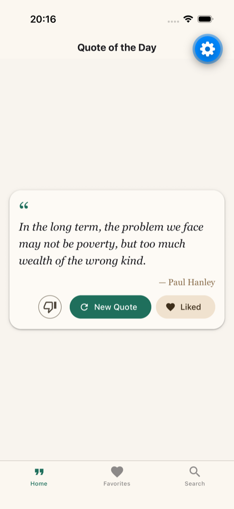
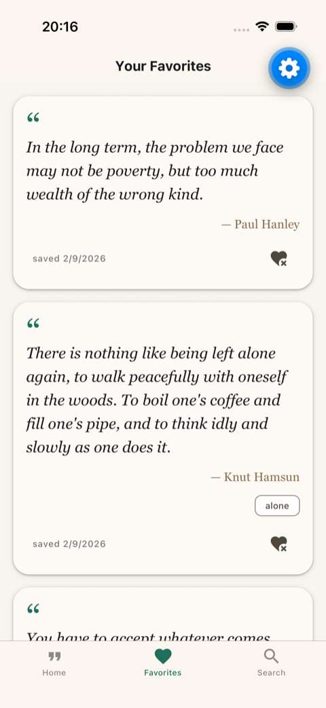
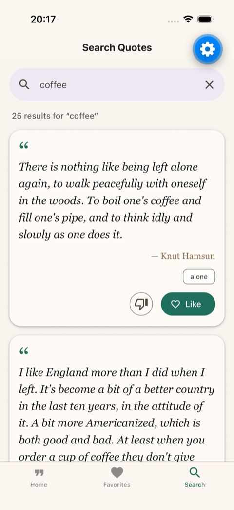
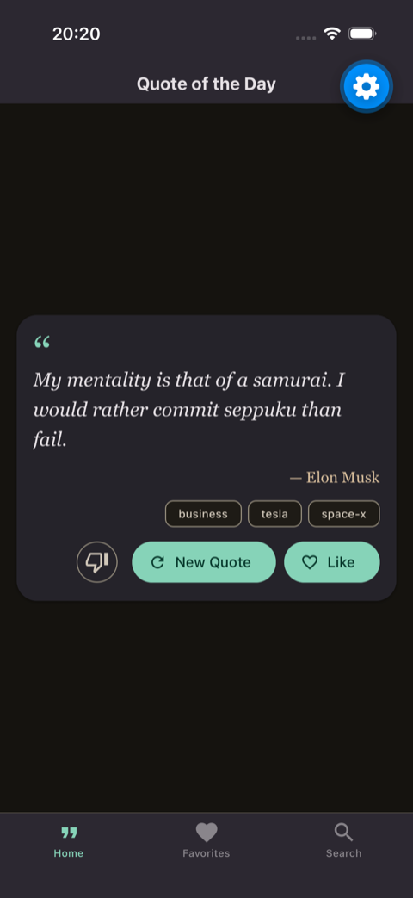
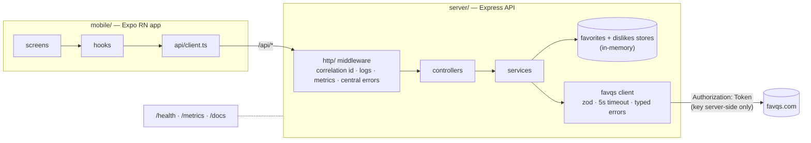

# Favorites Quotes

[](https://github.com/MHMALEK/vodafone-ziggo-favorite-quotes/actions/workflows/ci.yml)

Fullstack assessment: an Express + TypeScript REST API that wraps the [FavQs API](https://favqs.com/api) and manages liked quotes, with an Expo React Native client. Single user, no auth, per the brief.

**Live demo:** [morning-summit-455.fly.dev](https://morning-summit-455.fly.dev) · [Swagger UI](https://morning-summit-455.fly.dev/docs) — auto-stops when idle, so the first request may take a few seconds.

## Features

- Quote of the day, like/unlike, favorites list with unlike, keyword search
- Search as you type: debounced (400ms) and throttled (1.2s max wait), min 3 characters, auto-reset on clear
- "Don't show this again": a hidden quote disappears from search, gets skipped for quote of the day, and drops out of favorites
- Light and dark theme, loading/error/empty states on every screen, app-level error boundary
- Ops-ready API: structured JSON logs with correlation ids, Prometheus `/metrics`, OpenAPI docs, graceful shutdown, Docker image, CI/CD to Fly.io

## Screens

| Home | Favorites | Search | Dark mode |
|---|---|---|---|
|  |  |  |  |

## Quick start

Needs Node ≥ 20. Docker optional.

1. Sign up at [favqs.com](https://favqs.com) (Settings → API Key), then:
   ```bash
   cd server && cp .env.example .env   # put the key in FAVQS_API_KEY
   ```
   That file is the only place the key lives: not in the app, not in logs, not in the Docker image (see [docs/SECRETS.md](docs/SECRETS.md)).
2. Install and run everything:
   ```bash
   make setup && make run              # API on :4000 + Expo, Ctrl+C stops both
   ```

Other ways in:

```bash
make ios          # app in the iOS simulator (API on http://localhost:4000)
```

```bash
make android      # app in the Android emulator (API preset to http://10.0.2.2:4000)
```

```bash
make docker-build && make docker-run  # API as a container
```

`make help` lists everything else. Physical device: copy `mobile/.env.example` to `.env` and set `EXPO_PUBLIC_API_URL=http://<your-machine-ip>:4000`.

## Architecture



The app never talks to FavQs. The API key never leaves the server. Both sides use the same layering: thin controllers/screens, business logic in services/hooks, storage and upstream access behind interfaces. The full decision log with trade-offs is in [docs/DECISIONS.md](docs/DECISIONS.md); the plan I worked from, one commit per ticket, is in [tickets/BACKLOG.md](tickets/BACKLOG.md).

## API

Interactive docs at `/docs`, raw spec at `/openapi.json`.

| Method & path | Success | Errors |
|---|---|---|
| `GET /api/quote` | 200 `{quote}` | 404 all offered quotes hidden, 502 upstream failed, 504 timeout |
| `GET /api/quotes/search?q=` | 200 `{quotes:[…]}` | 400 bad `q`, 502, 504 |
| `POST /api/favorites` | 201 created / 200 already saved (idempotent) | 400 invalid body |
| `GET /api/favorites` | 200 `{favorites:[…]}` newest first | — |
| `DELETE /api/favorites/:id` | 204 | 400 bad id, 404 unknown id |
| `POST /api/dislikes` | 201 hidden / 200 already hidden | 400 invalid body |
| `GET /api/dislikes` · `DELETE /api/dislikes/:id` | 200 `{dislikes:[ids]}` · 204 | 400 bad id, 404 |

Errors are always `{error: {code, message, correlationId}}`. Send an `x-request-id` header and it comes back as the correlation id, in the response and in the server logs.

## Testing

```bash
cd server && npm test               # unit + integration (vitest + supertest, 61 tests)
cd server && npm run test:coverage  # coverage gate: 90% lines, 85% branches
cd server && npm run test:e2e       # Playwright API tests, boots its own server
cd mobile && npm test               # screen + hook tests (jest-expo + RNTL, 19 tests)
make e2e-app                        # Maestro flow in the iOS simulator
```

CI runs lint, build, coverage-gated tests, the Playwright suite, mobile tests, and a Docker build on every push and PR. A green main branch deploys to Fly.io automatically.

## Deployment

Push to `main` → CI gates → `flyctl deploy`. Runtime secret lives in Fly, the deploy token in GitHub Actions — split explained in [docs/DEPLOYMENT.md](docs/DEPLOYMENT.md), production sketch (Kubernetes, probes, GitOps) below in the assessment answers.

## Assessment questions

**What did I implement?**
Everything in the required and optional scope: quote of the day, save/list/delete favorites, search, all three screens with loading/error/empty states, dark mode, tests on both sides. Plus "don't show this again" (block-list enforced in the service layer), debounced/throttled search-as-you-type, an error boundary, and what I'd want in any service I run: central error handling, JSON logs with correlation IDs, `/metrics`, OpenAPI docs, Docker, CI/CD with a live demo, graceful shutdown.

**Why did I implement or skip certain things?**
The backend is what's being evaluated, so the depth went there. I skipped a database (allowed by the brief, reasoning below), auth (out of scope), FavQs caching and retries (assessment traffic never hits their rate limits), and app-side state management (nothing to cache in an app this small).

**What trade-offs did I make?**
- In-memory storage: favorites and dislikes die on restart. Both sit behind store interfaces, so a Postgres/SQLite swap is a one-file change.
- Express over NestJS: the brief asks for Express, and 8 endpoints don't justify Nest. The layout maps 1:1 to Nest anyway: controllers, services as providers, the error middleware as an exception filter.
- Quote-of-the-day retries at most 3 FavQs calls when quotes are hidden, then returns 404. Bounded upstream cost over a guaranteed answer.
- The OpenAPI spec is hand-written and can drift. Generating it from the zod schemas is the fix.

**What would I improve with more time?**
SQLite behind the existing store interfaces, a shared types package (the mobile client duplicates the DTOs), OpenAPI generated from zod, qotd caching plus retry with jitter on reads, rate limiting, OpenTelemetry tracing on top of the existing correlation IDs, E2E in CI against a mocked FavQs.

## Out of scope, on purpose

- **Auth**: single implicit user per the brief. If needed: OIDC, JWT checked in middleware before the routes, favorites keyed per user.
- **Database**: skipped for time and simplicity; the brief explicitly allows in-memory. Trade-off: data lost on restart, one process = one dataset. Exit path: the `FavoritesStore`/`DislikesStore` interfaces make a real store a drop-in replacement in `index.ts` — first thing I'd add for production.
- **100% coverage**: the server gate is 90/85 (actuals ~100/96). `index.ts` bootstrap and test helpers are excluded; a few defensive branches aren't worth synthetic tests. No snapshot tests (they assert markup, not behavior) and no Detox/Maestro in CI (too heavy for this scope; the Maestro flow runs locally).
- **FavQs resilience extras**: no caching, retries, or circuit breaker. Timeouts and typed upstream errors are in.
- **Cloud infra beyond the demo**: one Fly machine proves the CD loop; the production story (Kubernetes Deployment with probes on `/health` — which never calls FavQs, so a FavQs outage degrades responses instead of dropping pods — ConfigMap + secret manager, Prometheus scraping, GitOps rollbacks) is documented, not built.
